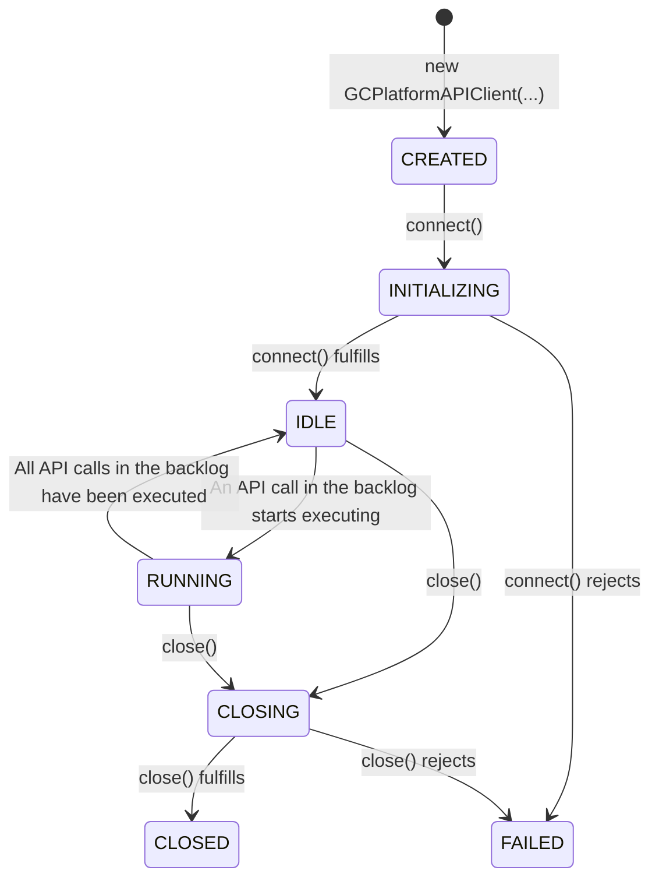

# Genesys Cloud Platform API client for Node.js

[](https://opensource.org/licenses/MIT)

The Genesys Cloud Platform API client for Node.js is a high-performance and easy-to-use client designed to access all API endpoints of Genesys Cloud organizations.

### Features

- **Ease of Use**: Simply instantiate the client, connect to Genesys Cloud, and start making API calls.
- **High Performance**: Automatically queues API calls and executes them at the maximum rate allowed by the Genesys Cloud Platform API.
- **Automatic Token Refresh**: Refreshes the Genesys Cloud OAuth access token automatically when it expires.
- **Rate Limit Handling**: Detects API calls that return a 429 (Too Many Requests) status code, suspends the execution of the API call backlog, and waits for the rate limit to expire before retrying.
- **Retry with Exponential Backoff Logic**: Automatically retries API calls that fail with status codes 408, 500, 502, 503, and 504, applying exponential backoff logic between retries.
- **Performance Monitoring Events**: Emits events when API calls are added and removed from the backlog and execution queues, when client state changes, and when API calls start and end, among others.

## Table of Contents

- [What is New](#what-is-new)
  - [Version 0.1.0](#version-010)
- [Installation](#installation)
- [Usage](#usage)
  - [Genesys Cloud Platform API classes](#genesys-cloud-platform-api-classes)
  - [Basic Usage](#basic-usage)
  - [Advanced Usage](#advanced-usage)
- [Genesys Cloud Platform API client States](#genesys-cloud-platform-api-client-states)
- [The `GCPlatformAPIClient` Class](#the-gcplatformapiclient-class)
  - [Static Properties](#static-properties)
  - [Instance Properties](#instance-properties)
  - [Instance Methods](#instance-methods)
    - [Constructor](#constructor)
    - [`connect()`](#connect)
    - [`close()`](#close)
    - [`queueAPICall()`](#queueapicall)
    - [`on()`](#on)
- [Testing](#testing)
- [Contributing](#contributing)
- [License](#license)

## What is New

### Version 0.1.0

- Initial beta release.

## Installation

You can install this module via `npm`:

```shell
npm install @jfabello/gc-platform-api-client
```

## Usage

To use the `gc-platform-api-client` module, first import it into your code and then create an instance of the `GCPlatformAPIClient` class.

### Genesys Cloud Platform API classes

Access to methods that call the Genesys Cloud Platform API endpoints is provided through a set of classes that are exposed as properties of the `GCPlatformAPIClient` instances. Each class corresponds to a specific category of Genesys Cloud Platform API endpoints.

For a full list of the Genesys Cloud Platform API classes and their methods [click here](docs/classes/api-classes.md).

### Basic Usage

This is a basic example of how to use the Genesys Cloud Platform API client. It demonstrates how to connect to Genesys Cloud, fetch the current token information, and then disconnect.

```javascript
import { GCPlatformAPIClient } from "@jfabello/gc-platform-api-client";

// This is just for demonstration purposes, never hardcode your credentials
const gcClientId = "f6eb9da0-4590-4bb7-82a0-f85afbfa1070";
const gcClientSecret ="pHe8l6Ro4raxeph13etrujufri9ecl5lwr0hlCrO-jQ";
const gcRegion = "us-east-1";

// Create a new GCPlatformAPIClient instance
const gcPlatformAPIClient = new GCPlatformAPIClient(gcClientId, gcClientSecret, gcRegion);

// Connect to Genesys Cloud
await gcPlatformAPIClient.connect();

// Fetch information about the current token
let myToken = await gcPlatformAPIClient.TokensAPI.getTokensMe();

// Log the token information
console.log(myToken);

// Disconnect from Genesys Cloud
await gcPlatformAPIClient.close();
```

### Advanced Usage

This is a complex example that demonstrates how to use the Genesys Cloud Platform API client to fetch all the routing queues and their members. It uses asynchronous functions and promises to handle multiple requests concurrently.

Note that although this example is pretty complex, it does not use `try`/`catch` blocks to handle errors. Please make sure to handle errors properly in your production code.

```javascript
import os from "node:os";
import { GCPlatformAPIClient } from "@jfabello/gc-platform-api-client";

// This is just for demonstration purposes, never hardcode your credentials
const gcClientId = "f6eb9da0-4590-4bb7-82a0-f85afbfa1070";
const gcClientSecret ="pHe8l6Ro4raxeph13etrujufri9ecl5lwr0hlCrO-jQ";
const gcRegion = "us-east-1";

// Create a new GCPlatformAPIClient instance
const gcPlatformAPIClient = new GCPlatformAPIClient(gcClientId, gcClientSecret, gcRegion);

// Connect to Genesys Cloud
await gcPlatformAPIClient.connect();

// Fetch the queues
const queues = [];
let getRoutingQueuesResultCurrentPage = 0;
let getRoutingQueuesResultPageCount = 0;

do {
	getRoutingQueuesResultCurrentPage++;
	const getRoutingQueuesResult = await gcPlatformAPIClient.RoutingAPI.getRoutingQueues({ pageNumber: getRoutingQueuesResultCurrentPage, pageSize: 100 });
	if ("entities" in getRoutingQueuesResult.body) queues.push(...getRoutingQueuesResult.body.entities);
	getRoutingQueuesResultCurrentPage = getRoutingQueuesResult.body.pageNumber;
	getRoutingQueuesResultPageCount = getRoutingQueuesResult.body.pageCount;
} while (getRoutingQueuesResultCurrentPage < getRoutingQueuesResultPageCount);

if (queues.length === 0) {
	console.log("No routing queues found.");
	process.exit(0);
}

// Get the members of each queue
const queuesMembersPromises = [];

for (const currentQueue of queues) {
	// This asynchronous function fetches all the members of a queue
	const getQueueMembers = async () => {
		const queueId = currentQueue.id;
		const queueName = currentQueue.name;
		const queueMembers = [];
		let getRoutingQueueMembersResultCurrentPage = 0;
		let getRoutingQueueMembersResultNextUri = null;

		do {
			getRoutingQueueMembersResultCurrentPage++;
			const getRoutingQueueMembersResult = await gcPlatformAPIClient.RoutingAPI.getRoutingQueueMembers(queueId, { pageNumber: getRoutingQueueMembersResultCurrentPage, pageSize: 100 });
			if ("entities" in getRoutingQueueMembersResult.body) queueMembers.push(...getRoutingQueueMembersResult.body.entities);
			getRoutingQueueMembersResultCurrentPage = getRoutingQueueMembersResult.body.pageNumber;
			if ("nextUri" in getRoutingQueueMembersResult.body) {
				getRoutingQueueMembersResultNextUri = getRoutingQueueMembersResult.body.nextUri;
			} else {
				getRoutingQueueMembersResultNextUri = null;
			}
		} while (getRoutingQueueMembersResultNextUri !== null);

		return {
			queueId,
			queueName,
			queueMembers
		};
	};

	// Start fetching the members of the queue and add the promise to the queuesMembersPromises array
	queuesMembersPromises.push(getQueueMembers());
}

// Wait for the members of all queues to be fetched
const queuesMembersResults = await Promise.allSettled(queuesMembersPromises);

// List the members of each queue
for (const currentQueue of queuesMembersResults) {
	if (currentQueue.value.queueMembers.length === 0) {
		console.log(`No members found for queue "${currentQueue.value.queueName}" (${currentQueue.value.queueId}).` + os.EOL);
		continue;
	}
	console.log(`Members of queue "${currentQueue.value.queueName}" (${currentQueue.value.queueId}):`);
	for (const currentMember of currentQueue.value.queueMembers) {
		const memberId = currentMember.id;
		const memberName = currentMember.name;
		console.log(`- ${memberName} (${memberId})`);
	}
	console.log(`Total members: ${currentQueue.value.queueMembers.length}` + os.EOL);
}

// Disconnect from Genesys Cloud
await gcPlatformAPIClient.close();
```

## Genesys Cloud Platform API client States

The `GCPlatformAPIClient` class provides the following states:



## The `GCPlatformAPIClient` Class

### Static Properties

- `CREATED`: A symbol that represents the CREATED state of the client.
- `INITIALIZING`: A symbol that represents the INITIALIZING state of the client.
- `IDLE`: A symbol that represents the IDLE state of the client.
- `RUNNING`: A symbol that represents the RUNNING state of the client.
- `CLOSING`: A symbol that represents the CLOSING state of the client.
- `CLOSED`: A symbol that represents the CLOSED state of the client.
- `FAILED`: A symbol that represents the FAILED state of the client.
- `errors`: An object that contains the Genesys Cloud Platform API client error classes as properties.

### Instance Properties

- `state`: A read-only property that returns the current state of the client.

### Instance Methods

#### `constructor()`

Creates a new instance of the Genesys Cloud Platform API client.

##### Parameters

- `gcClientId` (string): The Genesys Cloud OAuth client ID.
- `gcClientSecret` (string): The Genesys Cloud OAuth client secret.
- `gcRegion` (string): The Genesys Cloud region. For example: us-east-1, ca-central-1, ap-south-1, etc.
- `options` (object): Optional configuration options.
  - `socketTimeout` (number): HTTP socket timeout in milliseconds (default: 60000).
  - `timeBetweenRequests` (number): Time in milliseconds between API calls (default: 200).
  - `maxRetries` (number): Maximum number of retries for retryable errors (default: 5).

##### Throws

- `ERROR_GC_PLATFORM_API_CLIENT_ID_TYPE_INVALID`: If the Genesys Cloud OAuth client ID is not a string.
- `ERROR_GC_PLATFORM_API_CLIENT_ID_INVALID_UUID`: If the Genesys Cloud OAuth client ID is not a valid UUID.
- `ERROR_GC_PLATFORM_API_CLIENT_SECRET_TYPE_INVALID`: If the Genesys Cloud OAuth client secret is not a string.
- `ERROR_GC_PLATFORM_API_CLIENT_REGION_TYPE_INVALID`: If the Genesys Cloud region is not a string.
- `ERROR_GC_PLATFORM_API_CLIENT_REGION_INVALID`: If the Genesys Cloud region is not a valid region.
- `ERROR_GC_PLATFORM_API_CLIENT_SOCKET_TIMEOUT_TYPE_INVALID`: If the socket timeout option is not an integer.
- `ERROR_GC_PLATFORM_API_CLIENT_SOCKET_TIMEOUT_OUT_OF_BOUNDS`: If the socket timeout option is less than 1 millisecond.
- `ERROR_GC_PLATFORM_API_CLIENT_TIME_BETWEEN_REQUESTS_TYPE_INVALID`: If the time between requests option is not an integer.
- `ERROR_GC_PLATFORM_API_CLIENT_TIME_BETWEEN_REQUESTS_OUT_OF_BOUNDS`: If the time between requests option is less than 1 millisecond.
- `ERROR_GC_PLATFORM_API_CLIENT_MAX_RETRIES_TYPE_INVALID`: If the max retries option is not an integer.
- `ERROR_GC_PLATFORM_API_CLIENT_MAX_RETRIES_OUT_OF_BOUNDS`: If the max retries option is less than 1.

#### `connect()`

Connects the client to Genesys Cloud.

##### Returns

A promise that fulfills to `true` if the client connects successfully.

##### Throws

- `ERROR_GC_PLATFORM_API_CLIENT_INIT_UNAVAILABLE`: If the client is not in a state that allows its initialization.
- `ERROR_GC_PLATFORM_API_CLIENT_INTERNAL_ERROR`: If an internal error occurs.
- `ERROR_GC_PLATFORM_API_CLIENT_ID_NOT_FOUND`: If the Genesys Cloud OAuth client ID is not found.
- `ERROR_GC_PLATFORM_API_CLIENT_AUTHENTICATION_FAILURE`: If the Genesys Cloud OAuth authentication fails.
- `ERROR_GC_PLATFORM_API_CLIENT_UNEXPECTED_RESPONSE_ERROR`: If the Genesys Cloud OAuth access token request returns an unexpected response.
- `ERROR_GC_PLATFORM_API_CLIENT_UNEXPECTED_STATUS_CODE`: If the Genesys Cloud OAuth access token request returns an unexpected HTTP status code.

This method also throws the errors thrown by the `makeRequest()` method of the `HTTPClient` class. For more information see the [Promise-based HTTP and HTTPS client for Node.js](https://github.com/jfabello/http-client) documentation.

#### `close()`

Closes the client connection.

##### Parameters

- `clearBacklog` (boolean): If `true`, cancels all API calls in the backlog queue (default: `false`).

##### Returns

A promise that fulfills to `true` if the client is gracefully disconnected.

##### Throws

- `ERROR_GC_PLATFORM_API_CLIENT_CLOSE_UNAVAILABLE`: If the client is not in a state that allows it to close.
- `ERROR_GC_PLATFORM_API_CLIENT_INTERNAL_ERROR`: If an internal error occurs.
- `ERROR_GC_PLATFORM_API_CLIENT_UNEXPECTED_RESPONSE_ERROR`: If the Genesys Cloud OAuth access token deletion request returns an unexpected response.
- `ERROR_GC_PLATFORM_API_CLIENT_UNEXPECTED_STATUS_CODE`: If the Genesys Cloud OAuth access token deletion request returns an unexpected HTTP status code.

This method also throws the errors thrown by the `makeRequest()` method of the `HTTPClient` class. For more information see the [Promise-based HTTP and HTTPS client for Node.js](https://github.com/jfabello/http-client) documentation.

#### `queueAPICall()`

Queues a call to the Genesys Cloud Platform API.

Although this method is not meant to be used directly, it is available for advanced users who want to queue API calls manually instead of using the methods of the provided API classes.

##### Parameters
- `endpointPath` (string): The API endpoint path.
- `endpointMethod` (string): The HTTP method (e.g., GET, POST).
- `options` (object): Optional parameters for the API call.
  - `pathParameters` (object): Path parameters for the API call.
  - `headers` (object): Headers for the API call.
  - `queryParameters` (object): Query string parameters for the API call.
  - `body` (object): Request body for the API call.

##### Returns

A promise that fulfills to an `HTTPResponse` object containing the response from the API call. See the [Promise-based HTTP and HTTPS client for Node.js](https://github.com/jfabello/http-client) documentation for more information about the `HTTPResponse` class.

##### Throws

- `ERROR_GC_PLATFORM_API_CLIENT_API_CALL_PATH_TYPE_INVALID`: If the API endpoint path argument is not a string.
- `ERROR_GC_PLATFORM_API_CLIENT_API_CALL_PATH_INVALID`: If the API endpoint path argument is not a valid Genesys Cloud Platform API endpoint path.
- `ERROR_GC_PLATFORM_API_CLIENT_API_CALL_METHOD_TYPE_INVALID`: If the API endpoint method argument is not a string.
- `ERROR_GC_PLATFORM_API_CLIENT_API_CALL_METHOD_INVALID`: If the API endpoint method argument is not a valid HTTP method.
- `ERROR_GC_PLATFORM_API_CLIENT_API_CALL_PATH_PARAMETERS_TYPE_INVALID`: If the API endpoint path parameters argument is not an object.
- `ERROR_GC_PLATFORM_API_CLIENT_API_CALL_HEADERS_TYPE_INVALID`: If the API endpoint headers argument is not an object.
- `ERROR_GC_PLATFORM_API_CLIENT_API_CALL_QUERY_PARAMETERS_TYPE_INVALID`: If the API endpoint query string parameters argument is not an object.
- `ERROR_GC_PLATFORM_API_CLIENT_API_CALL_REQUEST_BODY_TYPE_INVALID`: If the API endpoint request body argument is not an object.
- `ERROR_GC_PLATFORM_API_CLIENT_API_CALLING_UNAVAILABLE`: If the API client is not in a state that allows calling the API.
- `ERROR_GC_PLATFORM_API_CLIENT_INTERNAL_ERROR`: If an internal error occurs.
- `ERROR_GC_PLATFORM_API_CLIENT_ID_NOT_FOUND`: If the Genesys Cloud OAuth client ID is not found when the access token is being refreshed.
- `ERROR_GC_PLATFORM_API_CLIENT_AUTHENTICATION_FAILURE`: If the Genesys Cloud OAuth authentication fails when the access token is being refreshed.
- `ERROR_GC_PLATFORM_API_CLIENT_UNEXPECTED_RESPONSE_ERROR`: If the Genesys Cloud OAuth access token refresh request returns an unexpected response.
- `ERROR_GC_PLATFORM_API_CLIENT_UNEXPECTED_STATUS_CODE`: If the Genesys Cloud OAuth access token refresh request returns an unexpected HTTP status code.

This method also throws the errors thrown by the `makeRequest()` method of the `HTTPClient` class. For more information see the [Promise-based HTTP and HTTPS client for Node.js](https://github.com/jfabello/http-client) documentation.

#### `on()`

Adds an event listener for the specified event.

##### Parameters

- `eventName` (string): The name of the event to listen for.
- `callback` (function): The function to call when the event is emitted.

##### Events

- `backlogqueue-add`: Emitted when an API call is added to the backlog queue.
- `backlogqueue-remove`: Emitted when an API call is removed from the backlog queue.
- `executionqueue-add`: Emitted when an API call is added to the execution queue.
- `executionqueue-remove`: Emitted when an API call is removed from the execution queue.
- `state-change`: Emitted when the state of the client changes.
- `accesstoken-refreshstart`: Emitted when the a request to refresh the OAuth access token is started.
- `accesstoken-refreshend`: Emitted when the request to refresh the OAuth access token ends.
- `accesstoken-deletestart`: Emitted when the a request to delete the OAuth access token is started.
- `accesstoken-deleteend`: Emitted when the request to delete the OAuth access token ends.
- `accesstoken-ratelimit`: Emitted when the request to refresh or delete the OAuth access token is rate limited. The client will wait for the rate limit to expire before retrying the request.
- `apicall-start`: Emitted when an API call is about to start.
- `apicall-end`: Emitted when an API call ends.

## Testing

To run the tests for this module, first clone the repository using the following command:

```shell
git clone https://github.com/jfabello/gc-platform-api-client.git
```

Then, navigate to the project directory and install the npm dependencies, this will install the Jest testing framework:

```shell
cd gc-platform-api-client
npm install
```

Set the environment variables with the Genesys Cloud credentials and region:

```shell
export GC_CLIENT_ID="f6eb9da0-4590-4bb7-82a0-f85afbfa1070"
export GC_CLIENT_SECRET="pHe8l6Ro4raxeph13etrujufri9ecl5lwr0hlCrO-jQ"
export GC_REGION="us-east-1"
```

Finally, run the tests using the following command:

```shell
npm test
```

## Contributing

Unfortunately, we are not able to accept contributions at this time.

If you find a bug in the code, please open an issue.

Thank you for your understanding.

## License

This project is licensed under the MIT License. See the [LICENSE](LICENSE) file for details.
